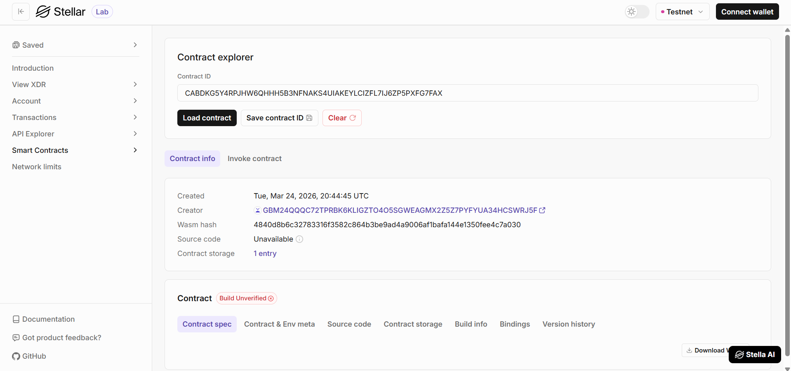

# Message Board ✉️

A fully functional, decentralized Web3 application built on the Stellar Soroban blockchain. This dApp allows users to securely set and view messages on-chain, featuring a glassmorphism frontend and an optimized Rust smart contract.

## Deployment Details

*   **Contract ID / Address:** `CABDKG5Y4RPJHW6QHHH5B3NFNAKS4UIAKEYLCIZFL7IJ6ZP5PXFG7FAX`
*   **Network:** Stellar Testnet
*   **Deployment Link:** `[Insert Deployment URL Here]`

## Dashboard Overview


## Stellar Labs Preview



## Features ✨

*   **Glassmorphism UI:** A beautiful, responsive frontend built with React, Vite, and CSS variables featuring modern glassmorphism design.
*   **On-Chain Message Storage:** The smart contract allows users to set and view messages on the Stellar blockchain.
*   **Non-Custodial Wallet Integration:** Securely connect and sign transactions using the [Freighter Browser Extension](https://www.freighter.app/).
*   **Smart Contract Security:** Optimized Rust smart contract built with the Soroban SDK.

## Project Architecture 🏗️

The project is divided into two main components:

1.  **Smart Contract (`/contracts/message-board`)**: Written in Rust using the Soroban SDK. It handles the core message board logic.
2.  **Frontend (`/frontend`)**: A React + Vite Web3 application that interacts with the deployed contract on the Soroban Testnet.

---

## Getting Started 🚀

### Prerequisites

*   [Node.js](https://nodejs.org/) (v18+)
*   [Rust](https://www.rust-lang.org/) (v1.94+)
*   [Stellar CLI](https://developers.stellar.org/docs/build/smart-contracts/getting-started/setup)
*   [Freighter Wallet Extension](https://www.freighter.app/)

### 1. Smart Contract

1. Navigate to the contract directory:
   ```bash
   cd contracts/message-board
   ```
2. Build the optimized `.wasm`:
   ```bash
   stellar contract build
   ```
3. Run unit tests:
   ```bash
   cargo test
   ```

### 2. Frontend Application

1. Navigate to the frontend directory:
   ```bash
   cd frontend
   ```
2. Install dependencies:
   ```bash
   npm install
   ```
3. Start the Vite development server:
   ```bash
   npm run dev
   ```
4. Open your browser to `http://localhost:5173`.

### Connecting your Wallet

1. Install the Freighter extension.
2. Switch the Freighter network to **Testnet**.
3. Fund your Freighter wallet using the [Stellar Laboratory Friendbot](https://laboratory.stellar.org/#account-creator?network=test).
4. Click **Connect Freighter** in the dApp.
